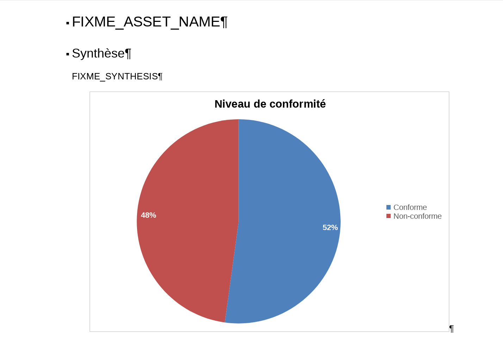
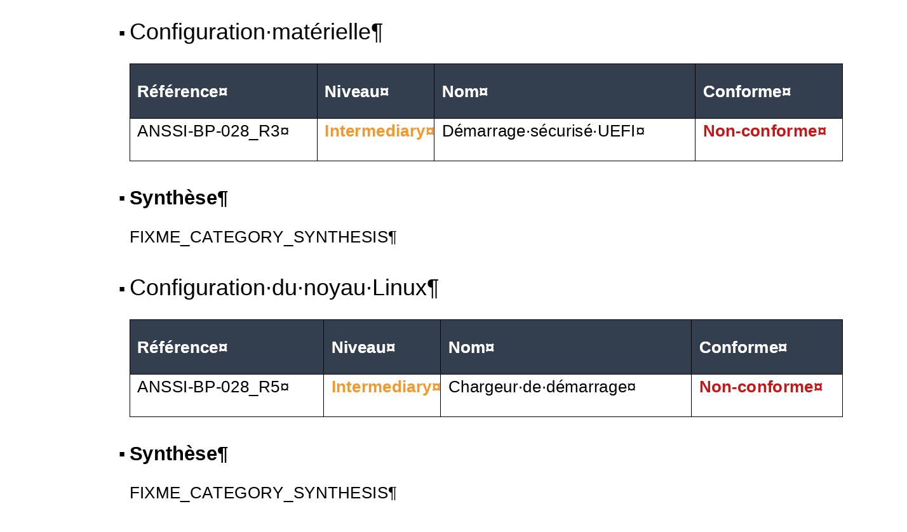

# octoaddins

  
    

  
  

These Addins allow you to import the results obtained with the octoconf tool.

| :information_source: Information |
|:-----------------------------------------------------------|
| This repository is mirrored from a private GitLab instance |

## Usage

For each imported file (1 file = 1 asset), the following elements are created :

- A global section containing a chart and a summary (to be written by the author);
- A section for each category, containing a table summarizing the results for each rule, and a section enabling conclusions to be drawn about the category's level of safety/compliance (to be written by the author)

See installation instructions for [ONLYOFFICE plugin](onlyoffice/) and [LibreOffice extension](libreoffice/).

| :information_source: Information |
|:-----------------------------------------------------------|
| The document style may change depending on your settings and the document template used. |

| :information_source: Information |
|:-----------------------------------------------------------|
| A single table is generated for each category. This table contains all the rules evaluated. The captions show only one row per table, as only one rule has been created for each category as an example. |

### ONLYOFFICE

- Go the `plugins` and select `octoconf`:

- Choose the `CSV` file generated with `octoconf` and import:

- Update each `FIXME` accordingly:

- Same here:

### LibreOffice

Soon :)

## TODO

- Internationalization

## Maintainer

- Nicolas GRELLETY

## Authors

- Nicolas GRELLETY

## Copyright and license

Copyright (c) 2023 Nicolas GRELLETY

This software is licensed under GNU GPLv3 license. See `LICENSE` file in the root folder of the project.

Icons made by [Freepik](https://www.flaticon.com/authors/freepik "Freepik") from [www.flaticon.com](https://www.flaticon.com/ "Flaticon")
